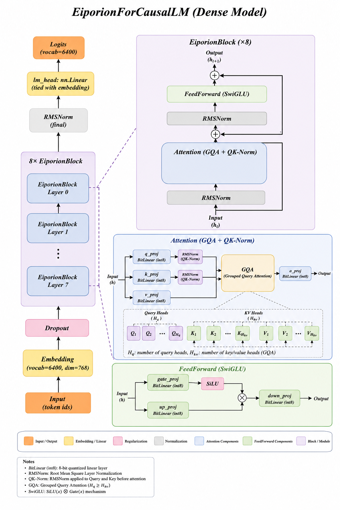
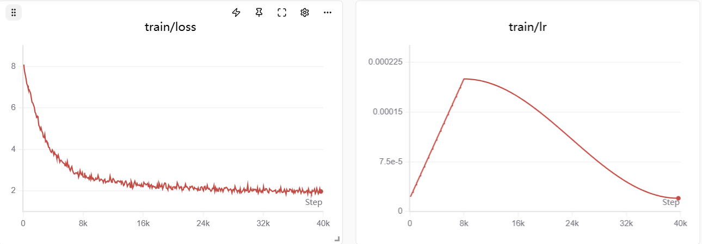

# Eiporion-MiniMind

A lightweight GPT-style language model based on [MiniMind3](https://github.com/jingyaogong/minimind)'s architecture, with linear layers replaced by **BitLinear** (int8 quantized weights) and trained using the **Eiporion** differentiable quantization training framework.

## Overview

Eiporion-MiniMind is a fully int8-quantized LLaMA-style decoder-only transformer. All attention projections (Q, K, V, O) and feed-forward projections (gate, up, down) use `BitLinear` layers with int8 weights and per-row float32 scaling factors. Only the final LM head remains as a standard `nn.Linear`.

Training uses **Differentiable Quantization Training (DQT)** — int8 weights are updated directly via stochastic rounding of 8-bit blockwise Adam gradients, powered by the `EiporionOptim` optimizer.

| Property | Value |
|----------|-------|
| Parameters | ~64M |
| Hidden Size | 768 |
| Layers | 8 |
| Attention Heads | 8 (4 KV heads, GQA) |
| Head Dimension | 96 |
| Intermediate Size | 2432 (SwiGLU) |
| Vocab Size | 6400 |
| Max Sequence Length | 32768 (YaRN scalable) |
| Weight Precision | int8 (BitLinear) |
| Optimizer | EiporionOptim (8-bit Adam + stochastic rounding) |
| Dataset | pretrain_t2t_mini (MiniMind) |

## Architecture



- **Grouped-Query Attention (GQA)** with QK-Norm (RMSNorm on query and key heads)
- **RoPE** positional embeddings with YaRN scaling support for long contexts
- **SwiGLU** activation in feed-forward layers
- **Weight tying** between embedding and LM head
- All linear projections use **BitLinear** with int8 weights; only lm_head uses float32

## Training

```bash
python trainer/train_pretrain.py
```

Key hyperparameters:
- Epochs: 2
- Batch size: 64 (gradient accumulation steps: 4)
- Learning rate: 2e-4 (cosine schedule, 8000 warmup steps)
- Max sequence length: 512
- Weight decay: 0.1
- Gradient clipping: 1.0

### Training Loss Curve



## Benchmarks

### C-Eval (0-shot)

| Task | Acc |
|------|-----|
| Art Studies | 45.45% |
| Discrete Mathematics | 37.50% |
| High School Biology | 36.84% |
| Professional Tour Guide | 34.48% |
| Mao Zedong Thought | 33.33% |
| Middle School Politics | 33.33% |
| Plant Protection | 31.82% |
| **Overall (52 tasks)** | **23.25%** |

### CMMLU (0-shot)

| Task | Acc |
|------|-----|
| College Education | 31.78% |
| College Engineering Hydrology | 30.19% |
| Elementary Mathematics | 28.26% |
| Food Science | 27.97% |
| Arts | 27.50% |
| High School Chemistry | 27.27% |
| **Overall (67 tasks)** | **25.30%** |

### General Benchmarks (0-shot)

| Benchmark | Acc | Acc Norm |
|-----------|-----|----------|
| ARC-Easy | 28.45% | 28.32% |
| HellaSwag | 27.32% | 28.58% |
| PIQA | 52.23% | 50.82% |
| WinoGrande | 52.64% | — |

## Evaluation

Interactive chat evaluation:

```bash
python eval_llm.py
```

Batch evaluation with lm-eval:

```bash
lm_eval --model hf \
  --model_args pretrained=out/,trust_remote_code=True \
  --tasks ceval-valid,cmmlu,arc_easy,hellaswag,piqa,winogrande
```

## Export to HuggingFace Format

```bash
python scripts/export_hf.py
```

Exports the `.pth` checkpoint to `model.safetensors` with full config in `out/`.

## Project Structure

```
eporion-minimind/
├── model/
│   ├── model_eiporion.py    # Model architecture
│   ├── tokenizer.json       # Tokenizer (6400 vocab, ChatML format)
│   └── tokenizer_config.json
├── dataset/
│   └── llm_dataset.py       # Dataset classes
├── trainer/
│   ├── train_pretrain.py    # Pretraining script
│   └── train_util.py        # Training utilities
├── scripts/
│   └── export_hf.py         # Export to HuggingFace format
├── eval_llm.py              # Interactive evaluation
├── img/
│   ├── Model_Structure.png  # Model architecture diagram
│   └── train_loss.png       # Training loss curve
├── out/                     # Trained model artifacts
└── pyproject.toml
```

## Dependencies

- Python >= 3.12
- PyTorch (CUDA 12.4)
- transformers
- [eiporion](https://github.com/fumitoshi0524/eiporion) (BitLinear + EiporionOptim)
- bitsandbytes
- lm-eval
- datasets
- accelerate

## Acknowledgements

- Model architecture based on [MiniMind](https://github.com/jingyaogong/minimind)
- BitLinear quantization and EiporionOptim from the [Eiporion](https://github.com/fumitoshi0524/eiporion) project
- Trained on MiniMind's pretrain_t2t_mini dataset
